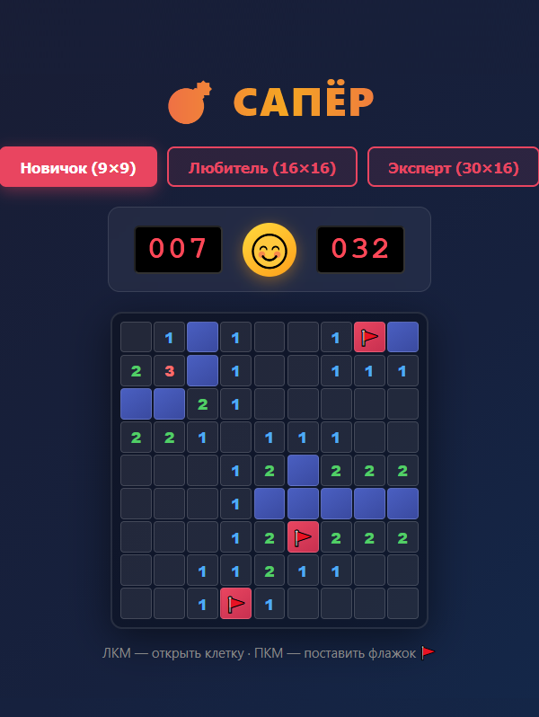

# 💣 Сапёр / Minesweeper

Классическая игра "Сапёр" в неоновом стиле.
Classic Minesweeper game in neon style.

##  Скриншот

---

## 🇷🇺 Русский

### Описание
Классический «Сапёр» с тремя уровнями сложности и неоновым дизайном. 
Ностальгия по Windows XP встречается с киберпанк-эстетикой.

### 🕹️ Как играть
- **ЛКМ** — открыть клетку
- **ПКМ** — поставить флажок 
- Цель: разминировать всё поле, не задев ни одной мины

### 🔗 Играть онлайн
- [GitHub Pages](https://epluribusneo.github.io/)
- [ВКонтакте](https://vk.ru/app54792470)
- [Веб страница разработчика](https://epluribusneo.ru/)

---

## 🇧 English

### Description
Classic Minesweeper with three difficulty levels and neon design.
Nostalgia for Windows XP meets cyberpunk aesthetics.

### 🕹️ How to play
- **LMB** — reveal cell
- **RMB** — place flag 🚩
- Goal: clear the field without hitting any mines

### 🚀 Play online
- [GitHub Pages](https://epluribusneo.github.io/)
- [VKontakte](https://vk.ru/app54792470)
- [Webpage](https://epluribusneo.ru/)

---

### 🤖 AI-Assisted Development
#### 🇷🇺 Русский
Проект создан с помощью AI (Qwen). 
Архитектура, дизайн и реализация — **Denis Pirogov** aka **EPluribusNEO**.

#### 🇧 English
This project was developed with the assistance of AI (Qwen).
The code architecture, design decisions, and final implementation were made by **Denis Pirogov** aka **EPluribusNEO**.

---
